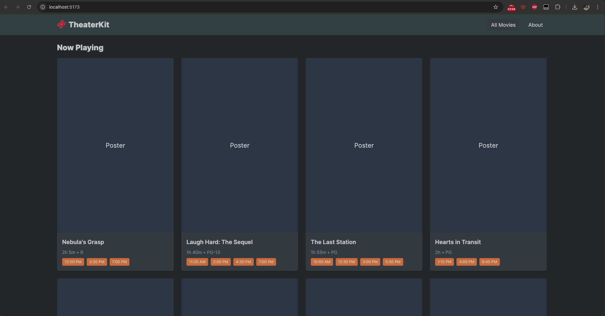
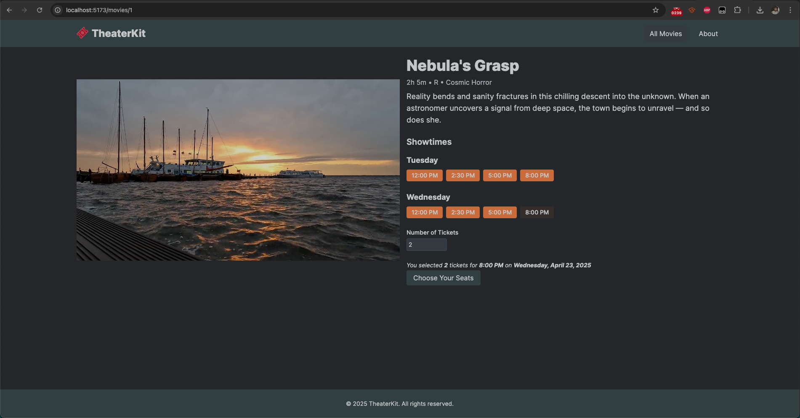
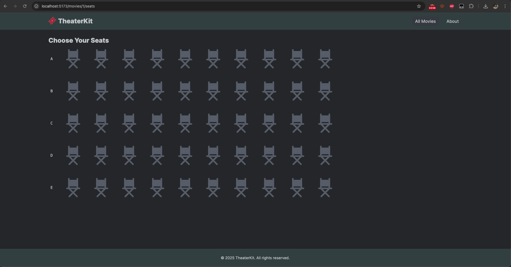
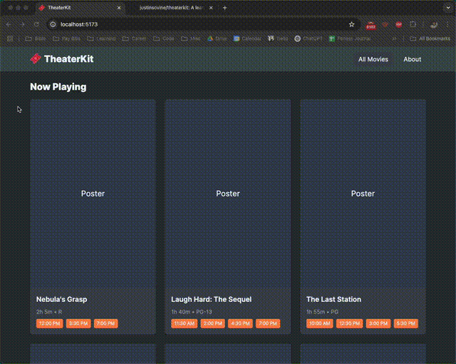

# TheaterKit

**TheaterKit** is a lean, full-stack movie theater booking app. It’s designed to let users browse showtimes, select seats interactively, and check out. It supports guest-friendly checkout flows and is structured to support future expansion into mobile apps.

This is a small and incomplete proof-of-concept built with Laravel on the backend and Vue on the frontend.

## Stack

- **Frontend:** Vue 3 with TailwindCSS
- **Backend:** Laravel serving a JSON API
- **Database**: MySQL (or SQLite for local use)  
- **Mobile (coming soon)**: Quasar to target iOS and Android  
- **Server**: NGINX + PHP-FPM + Node.js (deployed to VPS)

## Project Structure

<code>/theaterkit/
├── api/              # Laravel API
├── web/              # Vue.js front-end
├── LICENSE           # MIT license
├── README.md         # You're here</code>

## MVP Features

- Browse currently playing movies
- View showtimes and detailed movie info
- Select available seats with a visual UI
- Checkout flow with guest support
- Seeded movies and showtimes

## Status

Work in progress. Plans include calendar-based showtime views, concessions add-ons,  and real payment handling.

## Feedback

Have thoughts on booking systems or local entertainment tech? Feel free to open an issue or reach out.

## Screenshots

  
  
  

